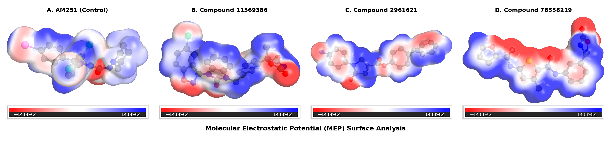

# GPR55 Antagonist Discovery

> **End-to-end structure-based discovery of novel GPR55 antagonists with anticancer potential** — high-throughput virtual screening → ADMET → all-atom molecular dynamics → MM-PBSA binding free energy → DFT.

[-success)]()
[]()
[-blue)](docs/GPR55_INTRODUCTION.md)
[-informational)]()
[](LICENSE)

---

## 🎯 Overview

This project discovers novel antagonists of **GPR55** (G-protein-coupled receptor 55), an atypical cannabinoid receptor overexpressed in aggressive cancers and signalling through the pro-oncogenic **Gα12/13** pathway. Using the 2025 cryo-EM structure (**PDB 9IYA**, 3.04 Å), a complete computational pipeline was run from a 10,940-compound library down to MD- and free-energy-validated lead candidates across **three distinct binding sites**.

**This is the full project**, taken from virtual screening through dynamics and quantum-chemical validation. The work was completed and **defended as a final-year thesis**; a manuscript is in preparation.

### Highlights
- **10,940** drug-like compounds screened across **3 binding sites** (orthosteric, allosteric, protein–protein interface)
- **100 ns molecular dynamics on 12 complexes (~1.2 µs aggregate)** in an explicit POPC membrane
- **MM-PBSA binding free energies** that re-ranked the docking hits and validated the leads
- **DFT (HOMO-LUMO / MEP)** electronic characterisation of the top compounds
- A novel allosteric hit that **outperforms the reference antagonist AM251** at its site

---

## 🔬 Pipeline

| Stage | Input | Method | Output |
|-------|-------|--------|--------|
| Pre-filter | 35,000+ | Lipinski Rule of Five | 10,940 drug-like |
| Stage 1 (HTVS) | 10,940 | AutoDock Vina, exhaustiveness 8 | ~750/site advanced |
| Stage 2 (precision) | ~750/site | AutoDock Vina, exhaustiveness 64, 15 modes | 373 validated hits |
| Selection | 373 | Top 25/site → ADMET filter | **9 candidates (3/site) + AM251** |
| Topology | 10 ligands | ACPYPE — GAFF2 + AM1-BCC | GROMACS-ready |
| Membrane build | — | CHARMM-GUI + OPM, POPC bilayer, CHARMM36m | 12 systems (~62k–225k atoms) |
| **MD** | 12 systems | **GROMACS, 100 ns production each (~1.2 µs total)** | trajectories |
| **Free energy** | 12 trajectories | **gmx_MMPBSA (MM-GBSA, 51 frames)** | ΔG_bind ranking |
| **DFT** | 4 leads | **ORCA, B3LYP/6-31G\*** | HOMO-LUMO, MEP, reactivity |

---

## 🧬 Target Sites

| Site | Location | Mechanism | Best Docking ΔG | AM251 |
|------|----------|-----------|-----------------|-------|
| **P0** | Orthosteric (TM core) | Competitive antagonism | **−12.3 kcal/mol** | −9.46 |
| **P3** | Allosteric (ECL region) | Non-competitive modulation | −8.5 kcal/mol | −7.70 |
| **Interface** | GPR55–Gα12/13 contact | PPI / signal-coupling block | −9.6 kcal/mol | −6.27 |

---

## 🏆 Validated Results (MD + MM-PBSA, 100 ns)

Binding free energies (ΔG_bind, kcal/mol) from `gmx_MMPBSA` over 51 frames of each 100 ns trajectory. **Note how dynamics re-rank the static docking hits** — the central scientific takeaway.

**Orthosteric (P0)**
| Compound | ΔG_bind | ± SD | Note |
|----------|---------|------|------|
| AM251 (control) | −35.06 | 4.33 | reference antagonist |
| **compound_11569386** | **−26.30** | 1.94 | **strongest novel binder (all sites)** |
| compound_76358219 | −17.19 | 2.52 | strong binder |

**Allosteric (P3)**
| Compound | ΔG_bind | ± SD | Note |
|----------|---------|------|------|
| **compound_2961621** | **−7.42** | 2.42 | **top allosteric — beats AM251 (−6.72)** |
| AM251 (control) | −6.72 | 2.40 | reference |

**Interface (PPI)**
| Compound | ΔG_bind | ± SD | Note |
|----------|---------|------|------|
| AM251 (control) | −13.03 | 2.14 | reference |
| CHEMBL432162 | −3.79 | 4.94 | moderate binder |

> **Key insight:** several top *docking* hits collapsed under MD (e.g. the best-docking P3 compound became a non-binder by MM-PBSA), while a lower-ranked compound emerged as the true allosteric lead. Static docking scores are hypotheses; dynamics and free-energy calculations are the validation.

---

## ⚛️ DFT Analysis

The four MD-validated leads (AM251, compound_11569386, compound_76358219, compound_2961621) underwent **DFT geometry optimisation and frontier-orbital analysis** (ORCA, B3LYP/6-31G\*): HOMO-LUMO gaps, derived global reactivity descriptors (hardness, softness, electrophilicity), and molecular electrostatic potential (MEP) surfaces — benchmarking each novel hit's electronic character against the AM251 control.

---

## 📊 Figures

The full set of analysis figures is in [`figures/`](figures/). Highlights (shown full-width for clarity):

**The three target binding sites — orthosteric (P0), allosteric (P3), and the GPR55–Gα12/13 interface**

<p align="center"></p>

**Backbone + ligand RMSD over 100 ns (all 12 systems)**

<p align="center"></p>

**DFT — molecular electrostatic potential (MEP) surfaces of the validated leads**

<p align="center"></p>

Also in `figures/`: RMSF, radius of gyration, SASA, hydrogen bonds, contacts, minimum distance, conformational snapshots, DCCM, free-energy landscape (FEL), PLIP interaction maps, and HOMO-LUMO orbitals.

---

## 🛠️ Stack

`AutoDock Vina` · `RDKit` · `ACPYPE / AmberTools (GAFF2, AM1-BCC)` · `CHARMM-GUI + OPM` · `GROMACS (CHARMM36m, POPC, TIP3P)` · `gmx_MMPBSA` · `ORCA (DFT)` · `MDAnalysis / PLIP` · `PyMOL` · Python · run on local GPU + Kaggle (T4) + Google Cloud.

## 📁 Repository

```
docs/          introduction, methodology, results, references, target coordinates
config/        docking grid + Vina configs for all 3 sites
figures/       structures, binding sites, MD & DFT analysis plots
notebooks/     control validation + pipeline notebooks
results/       Stage-3 docking outputs, top-75 hits, analysis
scripts/       docking, conversion, PyMOL rendering utilities
simulations/   MD setup references
manuscript/    manuscript drafts (in preparation)
```

## 📌 Status

Project **complete** and **thesis defended**. Manuscript **in preparation**. Companion published work: structure-based InlH inhibitor discovery — [InlH-1H6u-Inhibitor-Discovery](https://github.com/Aayush-ob/InlH-1H6u-Inhibitor-Discovery) (*In Silico Research in Biomedicine*, 2026).

---

*Author: Ayush Kumar Dewangan — computational drug discovery. Target structure: RCSB PDB 9IYA.*
